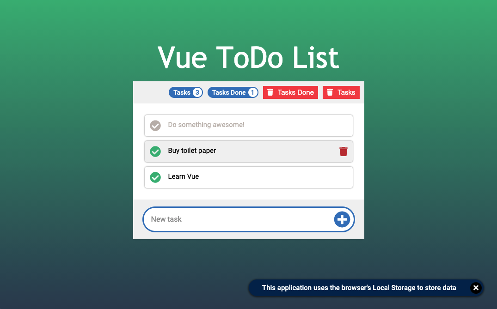

# Vue Todolist

### `vue-todolist` is an app task management application, a very typical productivity tool.



## Development interface


Is developed with **[vue.js](https://vuejs.org/)** 2.6.10 a Javascript framework. This project use [Vue Cli](https://cli.vuejs.org/) and has dependencies as webpack, google fonts and font awesome icon.

## Content

### Structure of folders

-   assets
    -   scss
    -   images
-   components
    -   UI
        -   Button
        -   Tag
    -   Page
        -   PageTitle
    -   Board
        -   Board
    -   Task
        -   TaskList
        -   TaskPreview
        -   TaskNew
-   _App.vue_
-   _main.js_
-   _index.html_

## How work

The `vue-todolist` is an application created in vue that allows you to list your pending tasks, both on a personal level for "shopping" or "reminders" and on a professional level to manage your projects.

It has a dashboard where you can add a task, mark it as done and delete it.
At the top of this board, you can see the total number of tasks and the total number of completed tasks, it also has 2 buttons, one to delete all tasks and another to delete only the completed tasks when there are any.
In the middle area of the board is shown the list of tasks, each task has 2 buttons, one to mark it as done and another one to delete it, any of these 2 actions animates the task when it enters and when it leaves the list.
And in the lower area of the board there is a field to enter the name of the new task by clicking on the button on the right or by pressing the enter key.

All the tasks are saved and updated in the browser's `Local Storage`.
Each task is a `object json` that has an identifier number or `id`, a name and its status. When the task is created the identifier number is generated from the total number of tasks plus the current one, and its status is marked as task not done.

## Project setup

```
npm install
```

### Compiles and hot-reloads for development

```
npm run serve
```

### Compiles and minifies for production

```
npm run build
```

### Run your tests

```
npm run test
```

### Lints and fixes files

```
npm run lint
```

### Publish in Github Pages

```
npm run deploy
```

### Customize configuration

See [Configuration Reference](https://cli.vuejs.org/config/).
